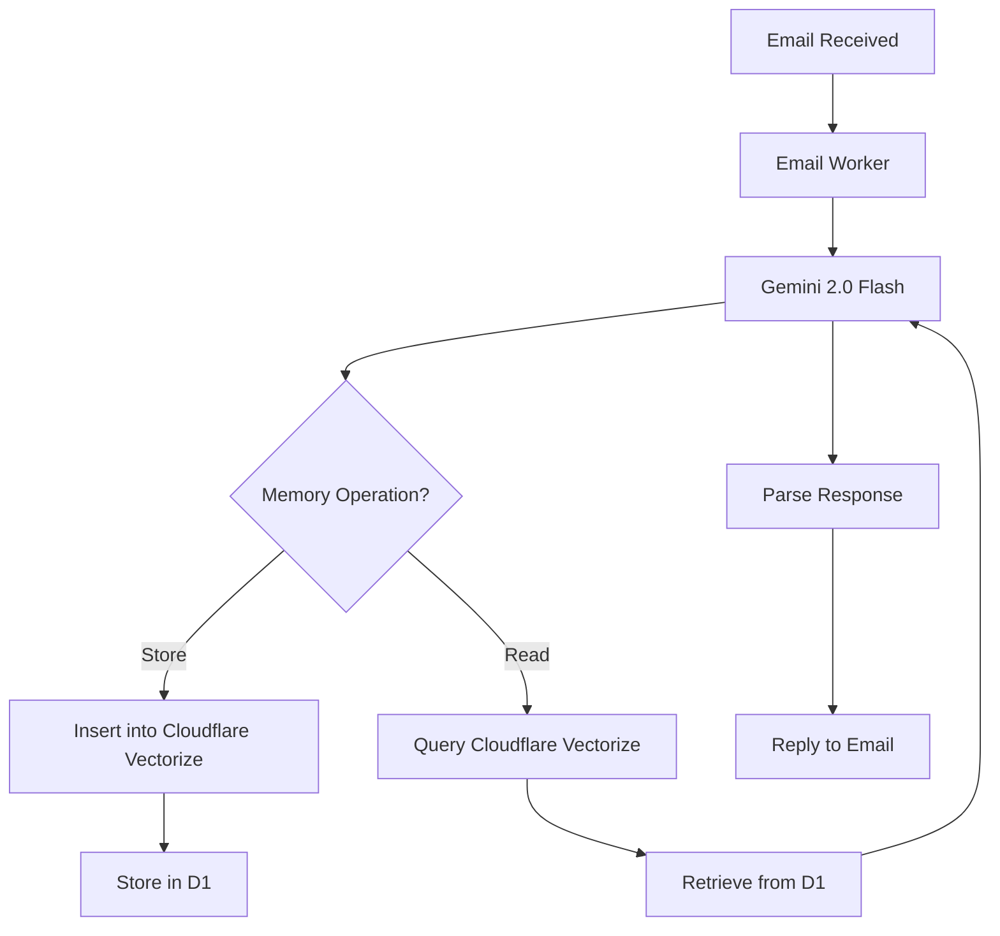

<div align="center">
  <a href="https://github.com/G4brym/askemail/">
    
  </a>
</div>

<p align="center">
    <em>Your Remote Coworker, One Email Away. Forward boring emails, get smart responses</em>
</p>

# AskEmail

AskEmail is an open-source AI email assistant that processes emails and provides intelligent responses using Google's Gemini model. Deploy it on your own Cloudflare infrastructure or use our hosted service.

## Quick Links

- 💻 **Source Code**: [github.com/G4brym/askemail](https://github.com/G4brym/askemail)

## Overview

AskEmail is a serverless AI assistant that processes emails and provides intelligent responses. It leverages Cloudflare Workers, Google's Gemini model, and vector databases to provide a powerful, privacy-focused email assistant that you can self-host.

## Key Features

- **📧 Email Processing**
	- Process and analyze email content and attachments
	- Summarize long email threads
	- Attachments are converted to markdown using [Workers AI toMarkdown](https://developers.cloudflare.com/workers-ai/features/markdown-conversion/)
	- Smart context-aware responses

- **🧠 Memory Management**
	- Optional conversation memory using vector database
	- Context-aware responses based on previous interactions
	- Explicit memory management (store/forget)

- **🛡️ Security & Privacy**
	- No data storage unless explicitly requested
	- No registration or login required
	- Fully self-hostable

## Architecture



## Installation Guide

### Prerequisites
- Node.js and npm installed
- Cloudflare account
- Google AI Studio API key
- Domain with Cloudflare email routing

### Step 1: Initial Setup
```bash
# Install dependencies
npm install

# Login to Cloudflare
npx wrangler login

# Create vector database
npx wrangler vectorize create askemail-index --dimensions=1024 --metric=cosine

# Create D1 database
npx wrangler d1 create askemail-db

# Apply database migrations
npx wrangler d1 migrations apply DB --remote
```

### Step 2: Configuration
1. Optionally setup daily rate limits in `src/configs.ts`

### Step 3: Deployment
```bash
# Deploy the worker
npx wrangler deploy

# Set Google AI API key
npx wrangler secret put GOOGLE_AI_KEY
```

### Step 4: Email Routing
Configure your domain's email routing in Cloudflare Dashboard:
1. Navigate to Email > Email Routing
2. Create a new routing rule pointing to your worker
3. Test the setup by sending an email

## Contributing

Contributions are welcome! Please feel free to submit a Pull Request or open an Issue with suggestions.

## License

This project is licensed under the MIT License - see the [LICENSE](LICENSE) file for details.
